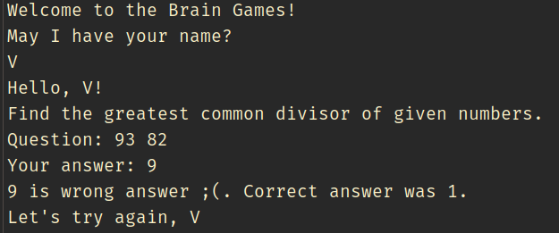
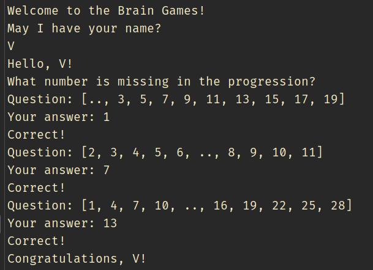
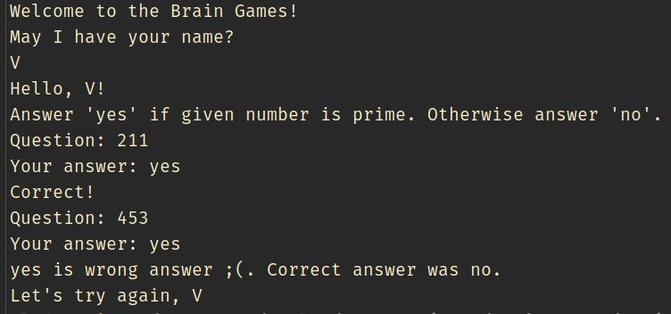

### Hexlet tests and linter status:
[](https://github.com/Zenjo93/java-project-61/actions)
[](https://codeclimate.com/github/Zenjo93/java-project-61/maintainability)

# Hexlet Project #1: "Brain Games"
My first Java project from Hexlet.io. Learned java basics on practice by developing 5 brainteaser games for Command Line interface (cli).

## How to install
For installing: clone repo to your computer and run following command in terminal ```make run-install``` from ```/app``` directory.
For running game type ```make run-dist```.

## Games description

##### #1 Brain Even Game

*Answer "yes" if the number is even, otherwise answer "no"*

[Example](https://asciinema.org/a/kDa9jXmnmDCSDxdA7vpWuZJiC)

##### #2 Brain Calc Game

What is the result of the expression?

[Example](https://asciinema.org/a/SHeqJdjm51gje5umxG3zCMYve)

##### #3 GCD Game

Find the greatest common divisor of given numbers.

<details>
<summary>Example:</summary>


</details>

##### #4 Progression Game

What number is missing in the progression?

<details>
<summary>Example:</summary>


</details>

##### #5 Prime Game

Answer 'yes' if given number is prime. Otherwise answer 'no'.

<details>
<summary>Example:</summary>


</details>

